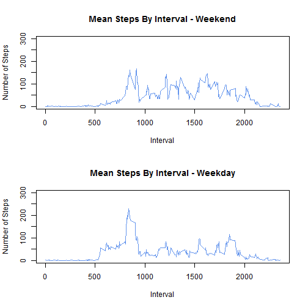

# Reproducible Research: Peer Assessment 1

## Loading and preprocessing the data

Load the activity data into a data.table (we like data.tables as they're fast), and convert the date column from characters to Dates.

```r
library(data.table)
actdata <- fread("activity/activity.csv")
actdata[, `:=`(date, as.Date(date, format = "%Y-%m-%d"))]
```

```
##        steps       date interval
##     1:    NA 2012-10-01        0
##     2:    NA 2012-10-01        5
##     3:    NA 2012-10-01       10
##     4:    NA 2012-10-01       15
##     5:    NA 2012-10-01       20
##    ---                          
## 17564:    NA 2012-11-30     2335
## 17565:    NA 2012-11-30     2340
## 17566:    NA 2012-11-30     2345
## 17567:    NA 2012-11-30     2350
## 17568:    NA 2012-11-30     2355
```


## What is mean total number of steps taken per day?
Create a data.table with the sum of steps for each day, excluding any observations missing step data.

```r
dailySteps <- actdata[!is.na(steps), sum(steps), by = date]
setnames(dailySteps, "V1", "daily.steps")
```


```
##           date daily.steps
##  1: 2012-10-02         126
##  2: 2012-10-03       11352
##  3: 2012-10-04       12116
##  4: 2012-10-05       13294
##  5: 2012-10-06       15420
## ---                       
## 49: 2012-11-25       11834
## 50: 2012-11-26       11162
## 51: 2012-11-27       13646
## 52: 2012-11-28       10183
## 53: 2012-11-29        7047
```

### *Histogram of the total number of steps taken each day*

```r
hist(dailySteps$daily.steps, 
      breaks = 8,
      ylim = c(0,25),
      col = "cornflowerblue",
      main = "Histogram of Steps Per Day",
      xlab = "Steps Per Day",
      ylab = "Frequency (Days)")
```

 

### *Mean and median total number of steps taken per day*

```r
meansteps <- mean(dailySteps$daily.steps)
meansteps
```

```
## [1] 10766
```

```r
medsteps <- median(dailySteps$daily.steps)
medsteps
```

```
## [1] 10765
```

Mean steps per day: **10766.189**

Median steps per day: **10765**

## What is the average daily activity pattern?
Create a data.table with the mean of steps for each interval, excluding any observations missing step data.

```r
intervalSteps <- actdata[!is.na(steps), mean(steps), by = interval]
setnames(intervalSteps, "V1", "mean.steps")
```


```
##      interval mean.steps
##   1:        0     1.7170
##   2:        5     0.3396
##   3:       10     0.1321
##   4:       15     0.1509
##   5:       20     0.0755
##  ---                    
## 284:     2335     4.6981
## 285:     2340     3.3019
## 286:     2345     0.6415
## 287:     2350     0.2264
## 288:     2355     1.0755
```


### *Time series plot of the mean steps per 5 minute interval across all days*

```r
plot(x = intervalSteps$interval, y = intervalSteps$mean.steps,
      ylim = c(0, 300),
      type = "l",
      col = "cornflowerblue",
      main = "Mean Steps By Interval",
      xlab = "Interval",
      ylab = "Mean Steps")
```

 


### *Interval containing the average maximum number of steps*

```r
maxinv <- intervalSteps[mean.steps == max(intervalSteps$mean.steps), interval]
maxinv
```

```
## [1] 835
```

Interval **835** is has the largest average number of steps.

## Imputing missing values
### *Total number of missing values in the dataset*

```r
nrowwithna <- sum(is.na(actdata$steps))
nrowwithna
```

```
## [1] 2304
```

There are **2304** rows with NA values.

### *Strategy for filling in all of the missing values in the dataset*
We fill in the missing steps values with the mean number of steps for the corresponding interval.

### *New dataset with missing data filled in*
A few notes on what this code is doing:

* The "by = interval" term creates a temporary sub-data.table for each unique interval.
* The ifelse() expression in the j term is run within the context of each sub-table. 
* .SD is a special reference to the sub-table, allowing us to determine the mean value of the steps column within each sub table. We set the value of any NA observations to that mean.


```r
actImp <- copy(actdata)
actImp[,steps := ifelse( is.na(steps), 
                        as.integer(mean(.SD$steps, na.rm = TRUE)), 
                        steps),
        by = interval]
```

```
##        steps       date interval
##     1:     1 2012-10-01        0
##     2:     0 2012-10-01        5
##     3:     0 2012-10-01       10
##     4:     0 2012-10-01       15
##     5:     0 2012-10-01       20
##    ---                          
## 17564:     4 2012-11-30     2335
## 17565:     3 2012-11-30     2340
## 17566:     0 2012-11-30     2345
## 17567:     0 2012-11-30     2350
## 17568:     1 2012-11-30     2355
```


### *Histogram of the total number of steps taken each day*
Using the table with imputed values, create a data.table with the sum of steps for each day, then generate a histogram using that summary table.


```r
dailyImputed <- actImp[, sum(steps), by = date]
setnames(dailyImputed, "V1", "daily.steps")
```


```
##           date daily.steps
##  1: 2012-10-01       10641
##  2: 2012-10-02         126
##  3: 2012-10-03       11352
##  4: 2012-10-04       12116
##  5: 2012-10-05       13294
## ---                       
## 57: 2012-11-26       11162
## 58: 2012-11-27       13646
## 59: 2012-11-28       10183
## 60: 2012-11-29        7047
## 61: 2012-11-30       10641
```


```r
hist(dailyImputed$daily.steps, 
      breaks = 8,
      ylim = c(0,25),
      col = "cornflowerblue",
      main = "Histogram of Steps Per Day",
      xlab = "Steps Per Day",
      ylab = "Frequency (Days)")
```

 


### *Mean and median total number of steps taken per day.*

```r
meanimp <- mean(dailyImputed$daily.steps)
meanimp
```

```
## [1] 10750
```

```r
medimp <- median(dailyImputed$daily.steps)
medimp
```

```
## [1] 10641
```

Mean steps per day (with imputed data): **10749.77**

Median steps per day (with imputed data): **10641**
#### *What is the impact of imputing missing data on the estimates of the total daily number of steps?*
Imputing missing step count values does cause the mean and median daily step counts to decrease, but only very slightly.

| NA Values   | Mean           | Median        |
| ----------- | -------------: | ------------: |
| Removed     | 10766.189  | 10765  |
| Imputed     | 10749.77    | 10641    |

## Differences in activity patterns between weekdays and weekends
#### *Create a new factor variable in the dataset indicating whether a given date is a weekday or weekend day*

```r
actImp[, day.type := as.factor(
                        ifelse( (tolower(weekdays(date)) == "saturday") | 
                                (tolower(weekdays(date)) == "sunday"),
                              "weekend", 
                              "weekday"))]
```

```
##        steps       date interval day.type
##     1:     1 2012-10-01        0  weekday
##     2:     0 2012-10-01        5  weekday
##     3:     0 2012-10-01       10  weekday
##     4:     0 2012-10-01       15  weekday
##     5:     0 2012-10-01       20  weekday
##    ---                                   
## 17564:     4 2012-11-30     2335  weekday
## 17565:     3 2012-11-30     2340  weekday
## 17566:     0 2012-11-30     2345  weekday
## 17567:     0 2012-11-30     2350  weekday
## 17568:     1 2012-11-30     2355  weekday
```

```r
levels(actImp$day.type)
```

```
## [1] "weekday" "weekend"
```

We can check that the day assignment was correct with the following summary. topn=10 is used to ensure we show 5 weekdays bookended with 2 weekends.

```r
print(actImp[, unique(day.type), by = date], topn = 10)
```

```
##           date      V1
##  1: 2012-10-01 weekday
##  2: 2012-10-02 weekday
##  3: 2012-10-03 weekday
##  4: 2012-10-04 weekday
##  5: 2012-10-05 weekday
##  6: 2012-10-06 weekend
##  7: 2012-10-07 weekend
##  8: 2012-10-08 weekday
##  9: 2012-10-09 weekday
## 10: 2012-10-10 weekday
## ---                   
## 52: 2012-11-21 weekday
## 53: 2012-11-22 weekday
## 54: 2012-11-23 weekday
## 55: 2012-11-24 weekend
## 56: 2012-11-25 weekend
## 57: 2012-11-26 weekday
## 58: 2012-11-27 weekday
## 59: 2012-11-28 weekday
## 60: 2012-11-29 weekday
## 61: 2012-11-30 weekday
```

### *Plots of the 5-minute interval and the mean steps taken in that interval across weekend and weekdays*
Let's create a summary table with the mean steps for each interval and day.type.

```r
stepsByType = actImp[, mean(.SD$steps), by = c("interval", "day.type")]
setnames(stepsByType, "V1", "mean.steps")
```


```
##      interval day.type mean.steps
##   1:        0  weekday     2.1556
##   2:        5  weekday     0.4000
##   3:       10  weekday     0.1556
##   4:       15  weekday     0.1778
##   5:       20  weekday     0.0889
##  ---                             
## 572:     2335  weekend    11.5000
## 573:     2340  weekend     6.2500
## 574:     2345  weekend     1.6250
## 575:     2350  weekend     0.0000
## 576:     2355  weekend     0.1250
```

Plot the summary table, enforcing a common y-axis scale to make comparisons between the plots easier.

```r
par(mfrow = c(2,1))
plot(x = stepsByType[day.type == "weekend",interval],
      y = stepsByType[day.type == "weekend",mean.steps],
      ylim = c(0, 300),
      type = "l",
      col = "cornflowerblue",
      main = "Mean Steps By Interval - Weekend",
      xlab = "Interval",
      ylab = "Number of Steps")
plot(x = stepsByType[day.type == "weekday",interval],
      y = stepsByType[day.type == "weekday",mean.steps],
      ylim = c(0, 300),
      type = "l",
      col = "cornflowerblue",
      main = "Mean Steps By Interval - Weekday",
      xlab = "Interval",
      ylab = "Number of Steps")
```

 

