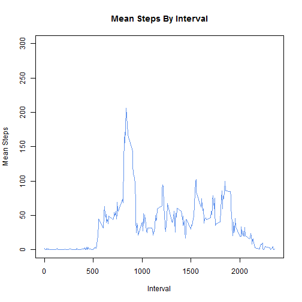
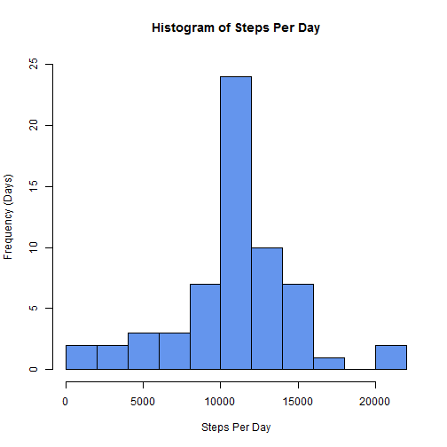

# Reproducible Research: Peer Assessment 1


## Loading and preprocessing the data

Load the activity data into a data.table (we like data.tables as they're fast), and convert the date column from characters to Dates.

```r
library(data.table)
actdata <- fread("activity/activity.csv")
actdata[, `:=`(date, as.Date(date, format = "%Y-%m-%d"))]
```

```
##        steps       date interval
##     1:    NA 2012-10-01        0
##     2:    NA 2012-10-01        5
##     3:    NA 2012-10-01       10
##     4:    NA 2012-10-01       15
##     5:    NA 2012-10-01       20
##    ---                          
## 17564:    NA 2012-11-30     2335
## 17565:    NA 2012-11-30     2340
## 17566:    NA 2012-11-30     2345
## 17567:    NA 2012-11-30     2350
## 17568:    NA 2012-11-30     2355
```


## What is mean total number of steps taken per day?
Create a data.table with the sum of steps for each day, excluding any observations missing step data.

```r
dailySteps <- actdata[!is.na(steps), sum(steps), by = date]
setnames(dailySteps, "V1", "daily.steps")
```

<!---
knitr won't preview dailySteps based on a setnames() call, so we do it ourselves
-->

```
##           date daily.steps
##  1: 2012-10-02         126
##  2: 2012-10-03       11352
##  3: 2012-10-04       12116
##  4: 2012-10-05       13294
##  5: 2012-10-06       15420
## ---                       
## 49: 2012-11-25       11834
## 50: 2012-11-26       11162
## 51: 2012-11-27       13646
## 52: 2012-11-28       10183
## 53: 2012-11-29        7047
```

### *Make a histogram of the total number of steps taken each day*

```r
hist(dailySteps$daily.steps, 
      breaks = 8,
      col = "cornflowerblue",
      main = "Histogram of Steps Per Day",
      xlab = "Steps Per Day",
      ylab = "Frequency (Days)")
```

 

### *Calculate and report the mean and median total number of steps taken per day*

```r
meansteps <- mean(dailySteps$daily.steps)
medsteps <- median(dailySteps$daily.steps)
```

Mean steps per day: **1.0766 &times; 10<sup>4</sup>**

Median steps per day: **10765**

## What is the average daily activity pattern?
Create a data.table with the mean of steps for each interval, excluding any observations missing step data.

```r
intervalSteps <- actdata[!is.na(steps), mean(steps), by = interval]
setnames(intervalSteps, "V1", "mean.steps")
```

<!---
knitr won't preview intervalSteps based on a setnames() call, so we do it here
-->

```
##      interval mean.steps
##   1:        0    1.71698
##   2:        5    0.33962
##   3:       10    0.13208
##   4:       15    0.15094
##   5:       20    0.07547
##  ---                    
## 284:     2335    4.69811
## 285:     2340    3.30189
## 286:     2345    0.64151
## 287:     2350    0.22642
## 288:     2355    1.07547
```


### *A time series plot of the 5-minute interval and the mean steps taken in that interval across all days.*

```r
plot(x = intervalSteps$interval, y = intervalSteps$mean.steps,
     type = "l",
      col = "cornflowerblue",
      main = "Mean Steps By Interval",
      xlab = "Interval",
      ylab = "Mean Steps")
```

 


### *Which 5-minute interval, on average across all the days in the dataset, contains the maximum number of steps?*

```r
maxinv <- intervalSteps[mean.steps == max(intervalSteps$mean.steps), interval]
```

Interval **835** is has the largest average number of steps.

## Imputing missing values
### *Calculate and report the total number of missing values in the dataset (i.e. the total number of rows with NAs)*

```r
nrowwithna <- sum(is.na(actdata$steps))
```

There are **2304** rows with NAs.

### *Devise a strategy for filling in all of the missing values in the dataset.*
We fill in the missing steps values with the median number of steps for the corresponding interval.

### *Create a new dataset that is equal to the original dataset but with the missing data filled in.*
A few notes on what this code is doing:

* The "by = interval" term creates a temporary sub-data.table for each unique interval.
* The ifelse() expression is run within the context of every sub-tables. 
* .SD is a special reference to the sub-table, allowing us to determine the median value of the steps column within each sub table. We set the value of any NA observations to that median.


```r
actImp <- copy(actdata)
actImp[,steps := ifelse( is.na(steps), 
                        median(.SD$steps, na.rm = TRUE), 
                        steps),
        by = interval]
```

```
##        steps       date interval
##     1:     0 2012-10-01        0
##     2:     0 2012-10-01        5
##     3:     0 2012-10-01       10
##     4:     0 2012-10-01       15
##     5:     0 2012-10-01       20
##    ---                          
## 17564:     0 2012-11-30     2335
## 17565:     0 2012-11-30     2340
## 17566:     0 2012-11-30     2345
## 17567:     0 2012-11-30     2350
## 17568:     0 2012-11-30     2355
```


### *Histogram of the total number of steps taken each day*
Using the table with imputed values, create a data.table with the sum of steps for each day, then generate a histogram using that summary table.


```r
dailyImputed <- actImp[, sum(steps), by = date]
setnames(dailyImputed, "V1", "daily.steps")
```


```
##           date daily.steps
##  1: 2012-10-01        1141
##  2: 2012-10-02         126
##  3: 2012-10-03       11352
##  4: 2012-10-04       12116
##  5: 2012-10-05       13294
## ---                       
## 57: 2012-11-26       11162
## 58: 2012-11-27       13646
## 59: 2012-11-28       10183
## 60: 2012-11-29        7047
## 61: 2012-11-30        1141
```


```r
hist(dailyImputed$daily.steps, 
      breaks = 8,
      col = "cornflowerblue",
      main = "Histogram of Steps Per Day",
      xlab = "Steps Per Day",
      ylab = "Frequency (Days)")
```

 


### *Calculate and report the mean and median total number of steps taken per day.*

### *Do these values differ from the estimates from the first part of the assignment?*

### *What is the impact of imputing missing data on the estimates of the total daily number of steps?*


## Are there differences in activity patterns between weekdays and weekends?
